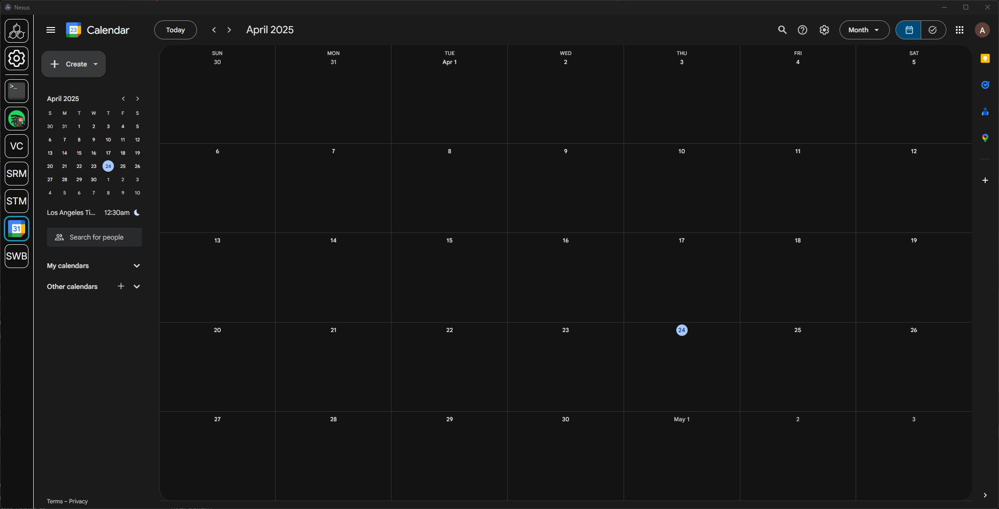

<h1 align="center">Introduction</h1>

## What is Nexus?
**Nexus** is a cross-platform application environment and loader. Developers can create applications, or **modules**, that can be loaded into the Nexus environment, keeping everything in one place. 

Think of **Nexus** as a customizable toolbox — one app that can do anything that you (or the community) build into it.

    

Nexus is **100% free**, including browsing the [application marketplace](https://nexus-app.net/marketplace) and developing your own application.

## Installing Nexus
Visit the Download page and install the correct version for your operating system.

### [Download Now](https://www.nexus-app.net/download)

At the moment, **Nexus is not signed** and may cause your computer to treat it as a suspicious program. 

## What is a module?

A **module** is an application written to run within the Nexus environment. This can be **anything**.

Check out some example modules to try out.

### [Discord Monkey](https://github.com/aarontburn/nexus-discord-monkey)
Many people have Discord open on their computer from startup to shutdown; why not free up some window clutter? Embed your Discord client as a Nexus module.

### [ChatGPT](https://github.com/aarontburn/nexus-chatgpt)
Use ChatGPT often? Embed ChatGPT as a Nexus module for quick access.

### Emails: [Gmail](https://github.com/aarontburn/nexus-google-gmail) and [Outlook](https://github.com/aarontburn/nexus-microsoft-outlook)
If you regularly check your email, embed them into Nexus.

## Why develop with Nexus?
You're probably wondering; what's the point of Nexus if I can just use Electron to build my own standalone application?

The theme of Nexus is interconnectivity and modularity; Nexus manages many parts of your application so **you** don't have to.

### 1. Setting Management
Your application might have various user preferences or settings. This involves a new UI page, along with internal setting management. Nexus manages that for you, having a dedicated module setting page for all installed modules. 

### 2. Module Communication
Unlike other desktop applications, Nexus provides a way for your module to communicate with other installed modules, along with expose an API that other modules can communicate with.

An example use-case is integration with the [Debug Console](https://www.nexus-app.net/marketplace/68342d1da2fbe5b2c6a76ce6) module; by having this module installed, other modules can add commands easily for easy debugging.

### 3. Automatic, In-App Module Updating
Easily add remote updating to your module so your users have the latest release.

### 4. Export and Distribution
Easily package your module into a lightweight `.zip` to share with others, or on the official [Nexus Marketplace](https://nexus-app.net/marketplace); no need to worry about different build configurations for different operating systems*.

## What can you make with Nexus?
Well, *anything*. Specifically, anything you can make using the Electron API, Node.js API, and any external packages. There are no restrictions or constraints.

Here are some possible examples:

1. **Website Embeds**: Embed any website as a native desktop application (e.g. [Google Calendar](www.nexus-app.net/marketplace/6837a62e382d9ca237cba6e3) or [Instagram](www.nexus-app.net/marketplace/6837a62e382d9ca237cba6e3)).
2. **Custom Tooling**: Create full-fledged applications within Nexus (e.g. [Color Picker](https://www.nexus-app.net/marketplace/68342fbea2fbe5b2c6a76cf1))
3. **Internal System Tools**: If you need a module that doesn't need a GUI, Nexus supports modules that run in the background to do anything you need it to do (this is how auto-updating and the popup modal is coded).

