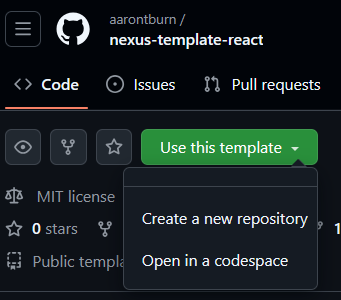

# Nexus: Webpage Template Setup

## Overview
This template helps you create module embedding an existing website. 

## Installation

Visit the template repository:

### [Nexus Webpage Template](https://github.com/aarontburn/nexus-template-webpage)
<sup>or https://github.com/aarontburn/nexus-template-webpage</sup>

and click the "Use this template" button, followed by "Create a new repository".



If you don't want to make a GitHub repository, download the template files and remove the hidden `.git` folder.

Once downloaded/cloned, open your text editor to the root directory of the project. Open a CLI in the same location and run

```
npm install
```
To install the required packages.


To get a grasp on the program, run the command (in the root directory):
```
npm start
```
to start Nexus with your sample module loaded.


## Project Structure
After downloading the template and running `npm install`, your project should look something like this:

```
root/
+-- node_modules/
+-- src/
    +-- process/
        +-- main.ts

    +-- renderer/
        +-- index.html
        +-- renderer.ts
        +-- styles.css

    +-- module-info.json

+-- .gitattributes
+-- .gitignore
+-- electron.ts
+-- package-lock.json
+-- package.json
+-- README.md
+-- tsconfig.json
```
Let's break down each section of the project.


### Low Maintenance Files
Starting with root files and directories that are self-explanatory, unchanged from standard Node.js projects, or will require very little configuration:

- `node_modules/`: This is where dependencies are installed.
- `.gitattributes`: Standard [git attributes](https://git-scm.com/docs/gitattributes).
- `.gitignore`: Standard [.gitignore](https://git-scm.com/docs/gitignore).
- `package-lock.json`: Standard [package-lock.json](https://docs.npmjs.com/cli/v9/configuring-npm/package-lock-json).
- `README.md`: Standard [README.md](https://docs.github.com/en/repositories/.managing-your-repositorys-settings-and-features/customizing-your-repository/about-readmes). Change this to show off your module.
- `electron.ts`: This file is used to let your editor know that Electron is being used. This file is ignored and should not be modified.   
- `tsconfig.json`: Standard [tsconfig.json](https://www.typescriptlang.org/tsconfig/).
- `package.json`: Standard [package.json](https://docs.npmjs.com/cli/v9/configuring-npm/package-json). However, this does list many commands you may be using throughout development. See the [Commands](<./3.4 - Webpage Module Commands.md>) section for more information.

### Key Project Files
The file structure can be modified, however, all files used by your module **need to stay within the `src/` directory.**

```
root/
+-- src/
    +-- process/
        +-- main.ts
    
    +-- renderer/
        +-- index.html
        +-- renderer.ts
        +-- styles.css

    +-- module-info.json
```
- `src/`: This is the folder that will be converted into your module and should contain ALL of your source code and assets.
- `src/module-info.json`: A file containing metadata and export configurations for your module. Read the [Exporting](../ConfigurationAndExport.md) section for more details.
- `src/process/`: The directory containing all code and assets for the process (backend).
  -  `/process/main.ts`: The entry point to your module and the main [Process](<./3.2 - Webpage Module Process.md>). If you move or rename this file, ensure your changes are also reflected in `module-info.json` (read about [module-info.json](../../API/module-info.json.md)).
- `src/renderer/`: The directory containing all code and assets for the renderer (frontend).
  - `renderer/index.html`: The default UI for your module.
  - `renderer/renderer.ts`: The main logic file for the renderer. It listens for messages from the process and interacts with the DOM accordingly.
  - `renderer/styles.css`: The styling for `index.html`.


---
### Next Steps:
Now that you've understood how the project is laid out, visit the [Webpage Process](<./3.2 - Webpage Module Process.md>) guide to learn how it works.
