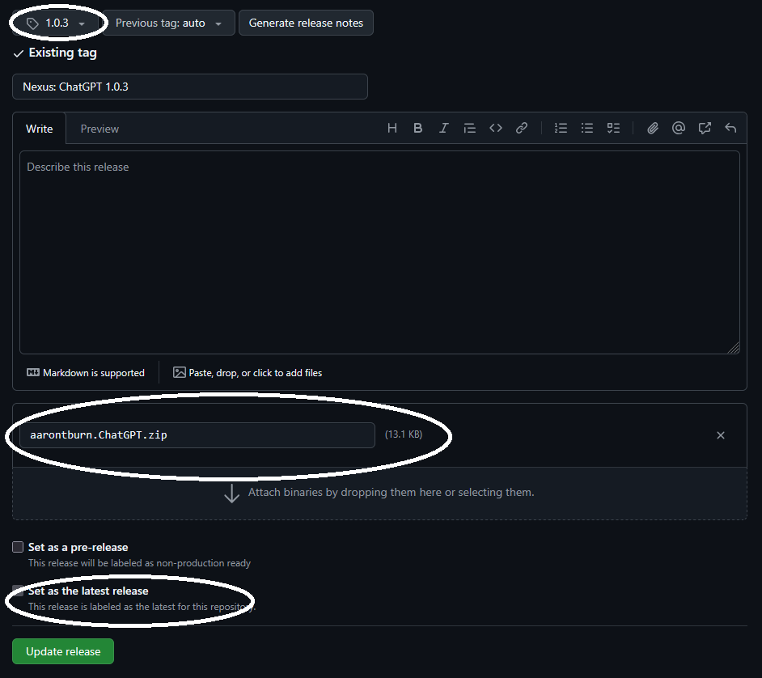
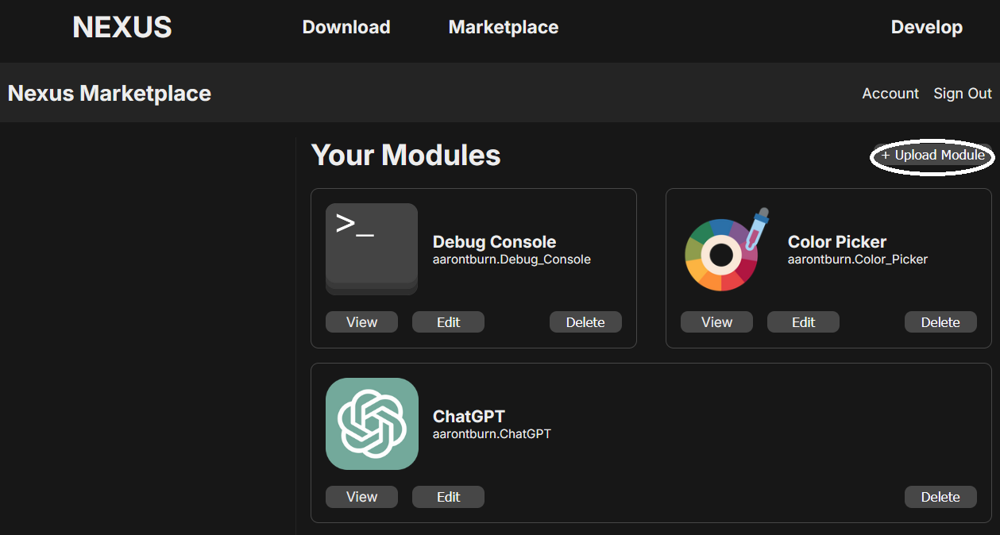

# Publishing to the Nexus Marketplace

## Overview
To share your module to the Nexus community, you can publish your module on the Nexus marketplace freely.

Most of your modules published information comes directly from your `module-info.json`, including your module name, ID, and description.

## Prerequisites

### Nexus Marketplace Account
You will need to create an account on the Nexus Marketplace, which can be done on the login/register page.


### Public GitHub Repository
In order to publish to the marketplace, you will need a **public** GitHub repository with a latest release.


## Publishing

1. After logging in/registering to the Nexus Marketplace, navigate to the `Account` page found in the marketplace header.
2. Copy your `User ID`.
3. In your module's `module-info.json`, add a new field `"author-id"` set to your user ID obtained in step 2.
``` jsonc
{
    "name": "ChatGPT",
    "id": "aarontburn.ChatGPT",
    "version": "1.0.3",
    "author": "aarontburn",
    "author-id": "6835188e7d1905beb62f1090", // <- your marketplace user ID
    //...
    "build": {
        // ...
    }
}
```
4. Create a new latest release in your public GitHub repository.

    The release should **only** have your module `.zip`, and the tag should be the version of your module as specified in your `module-info.json`.

    


    Your release description and title do not matter here.

5. On the marketplace, navigate to your `Account`.
   
    This page is where you can manage your published modules. Press the `+ Upload Module` button.

    

6. Paste in a link to your public GitHub repository (e.g. https://github.com/aarontburn/nexus-chatgpt).  
   <sub>Note that this should just be the repositories home page, not the latest release or anywhere else.</sub>

7. Press the `Check` button. After successfully loading, your module information (from your `module-info.json`) should be displayed.
   - (Optional) Upload an image. If no image is uploaded, it will default to an acronym to the first three letters of your module (e.g. Sample Nexus Module => SNM).
   - (Optional) Upload or type a README.md. Supports markdown. 

8. After verifying your information is correct, press the `Publish` button. If no errors occur, you will get a confirmation message.

## Conclusion
Your module is now public on the module marketplace! You are able to freely delete or update your modules information at any point from your account page.


   
## Notes
1. Due to a restriction on unauthorized GitHub API calls, you will only able to use the `Check` button 60 times per hour (read more [here](https://docs.github.com/en/rest/using-the-rest-api/rate-limits-for-the-rest-api?apiVersion=2022-11-28)) before you start getting rate limited.
2. For any images or assets in your README markdown, you will need to use absolute paths to a URL. Upload the images to your GitHub repository and directly link your images there.